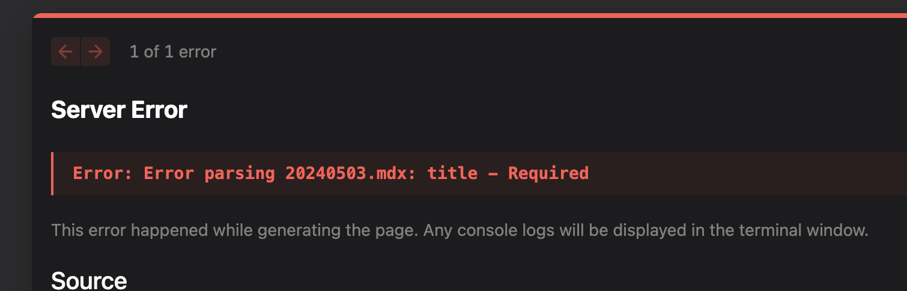

## how to create a new event
1. create a new file in the `_events` folder
   - the name of the should respect the following format: `YYYYMMDD.mdx`
1. the file structure follows the frontmatter pattern
   - the frontmatter should contain the following fields:
     - `date`: the date of the event in UTC format - **string**
     - `duration`: the duration of the event in minutes - **int**
     - `place`: the address of the event - **string**
     - `maps`: the link to the google maps of the event - **string**
     - `signup`: the link to the eventbrite page - **string**
     - `thumbnail`: the path to the thumbnail of the event (the image filename should be the same as the event filename but in the folder `assets/events`)  - **string**
     - `title`: the title of the event - **string**
     - `description`: a brief description of the event  - **string**
     - `speakers`: an array of string representing JSON object containing the following fields:
       - `name`: the name of the speaker - **string**
       - `role`: the role of the speaker - **string**
       - `thumbnail`: the path to the thumbnail of the speaker - **string**
       - `linkedinUrl`: the link to the LinkedIn profile of the speaker
     - `tags`: an array of tags related to the event - - **array of string**


## Is my event ready?
To check if your event is ready, you can run the application:
```bash
npm run dev
```
then if there are any errors, they will be shown directly in the page.

