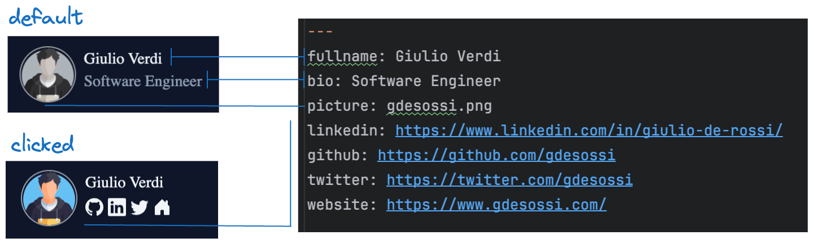
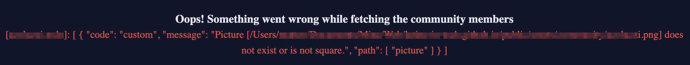

## Join the community
If you also are a proud member of the LiT community, you can place your self in the community site.<br/>
It could be worth for us and for you, for several reasons:

- be in touch with other members of the community
- be discovered by recruiters or other companies
- be part of the community and help it grow

## How can I add myself to the community page?
It's pretty simple, you just need to follow these steps:

- add a new file `.mdx` in the [_community/members]("../../../_community/members") folder, with your name as filename (e.g. `Giulio De Rossi` -> `gderossi.mdx`)
   - if you find a file with the same name, you can add a number at the end of the filename (e.g. `gderossi1.mdx`)
- add your information in the file, following the template below
```
---
fullname: Giulio De Rossi
bio: Junior Developer
picture: gdesossi.png
linkedin: https://www.linkedin.com/in/giulio-de-rossi/
github: https://github.com/gdesossi
twitter: https://twitter.com/gdesossi
website: https://www.gdesossi.com/
```
- here the structure of the fields:
   - `fullname`: your full name (required)
   - `bio`: a short description of yourself/job title (required)
   - `picture`: the name of the picture file
   - `linkedin`: your linkedin url profile
   - `github`: your github url profile
   - `twitter`: your twitter url profile
   - `website`: your personal url website



- for the optional fields, you can leave them empty if or omit at all
- add your picture in the [public/assets/community]("../../../public/assets/community") folder, with the same name as the picture field in the `.mdx` file
   - the picture should be a square image (e.g. 200x200px)
- try your changes locally
   - `yarn dev`
   - if there are any errors, they will be shown directly in the web page. In that case, fix them!

- create a pull request with your changes


